# Just Movie It

Just Movie It은 사용자의 좋아요, 리뷰 평점을 반영하여 적절한 영화를 추천해주는 서비스를 제공합니다.

이용자간에 팔로우를 통하여 관심있는 사람들의 좋아하는 영화 리스트나 리뷰 내역을 확인할 수 있습니다.


사이트 주소

 http://last-movie-pjt.xwqm6jpu2p.ap-northeast-2.elasticbeanstalk.com/movies/ 


### 역할 분담

팀원: 김평강, 배태한


김평강 작업 내역

- 22일

  추천 알고리즘 작성

  모델 정의 및 구성

  회원가입, 로그인, 로그아웃 기능 구현

  영화 관리자 페이지 작성

- 25일

  영화 관리자 페이지 개선

  평점 남기기 기능 추가

  좋아요, 팔로우 기능 추가

  영화 카드목록 도입

  좋아요, 팔로우 엑시오스 도입

- 26일

  영화 카드목록 도입 및 엑시오스 활용하여 좋아요 시 카드 테두리 변하게 설정

  추가 추천 목록 페이지 작성

  검색 기능 구현

- 27일

  프로필 페이지 작성

  추천 기능 개선

- 28일

  각종 폼에 부트스트랩 적용, 컴포넌트 배치 조정 등 스타일링 작업


배태한 작업 내역

- day 1

  영화진흥위원회 API를 활용하여 영화 데이터를 받아오는 기본 로직 작성

  

- day 2

  영화의 제목, 장르를 받아와 데이터베이스에 직접 저장하는 로직 구현

  

- day 3 

  나이에 따른 영화 데이터 노출 여부를 결정하기 위해 영화진흥위로부터 관람등급가 데이터 가져옴.

  추가적으로 영화 이미지, 영화의 시놉시스 데이터를 가져오기 위해 네이버 영화 API 사용.

  

- day 4

  beautifulsoap4 모듈을 이용해 시놉시스 데이터와 고화질 이미지를 크롤링해오는 로직 작성.

  데이터 크롤링을 원하는 시작 날짜와 끝 날짜를 사용자로부터 받아와 크롤링하는 기능 구현.

  사이트 스타일링 작업 시작

  

- day 5

  사이트 스타일링 마무리 작업


## 사용 가능한 기능

- 영화 목록을 볼 수 있는 페이지
- 영화 상세 정보를 볼 수 있는 페이지 및 영화에 평점 작성
- 추천 영화를 볼 수 있는 페이지
- 유저에 해당하는 정보(좋아요, 팔로우, 팔로잉, 작성한 리뷰)를 볼 수 있는 프로필 페이지
- 로그인, 로그아웃, 회원가입
- 검색 기능
- 관리자용 유저 수정 및 삭제 기능
- 관리자용 영화 등록, 수정 및 삭제 기능
- 관리자용 데이터 입력 받기 기능


## 기능 상세

### 전 페이지 공통 기능

유저의 나이를 확인하고 유저 나이보다 높은 연령 제한의 영화는 보여주지 않는다.


### 회원가입 및 영화 추천을 위한 정보 입력

회원 가입 시 나이를 입력 받는다.

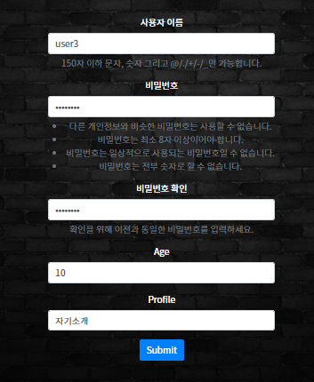

나이에 의해서 보여줄 영화를 선정한다. 등록된 나이가 영화에 등록된 나이보다 작을 경우 그 영화는 보여주지 않는다.

성인 유저에게 보이는 페이지. 영화가 많이 보인다.

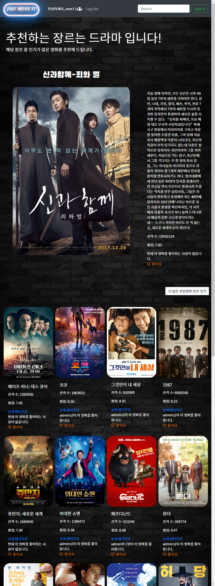


미성년 유저에게 보이는 페이지. 영화가 성인 유저보다 적게 보인다.

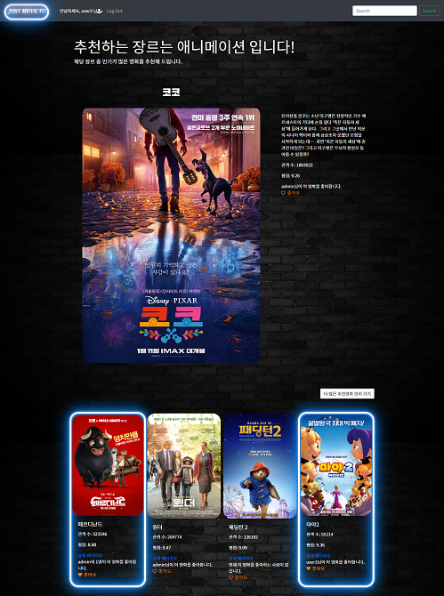


가입을 하고 나면 관객 수가 높은 영화들 중 12개를 선정하여 보여준다.

여기서 맘에 드는 영화를 좋아요 하면 추후 추천하는 데이터에 반영이 된다.


### 메인 페이지

주소:

```html
/movies/
```

메인 페이지에서는 해당 유저의 좋아요와 리뷰 작성 평점을 반영하여 장르를 선정하여 해당 장르에서 추천하는 영화를 하나 보여준다. 더 추천받고 싶다면 버튼 클릭을 통해서 more_recommend페이지로 이동하여 추천받을 수도 있다.

추천 영화 밑으로는 DB에 저장된 영화들의 간략 정보를 보여준다.


영화 포스터를 누르거나 상세 페이지로 링크를 누르면 영화 상세 페이지로 이동하여 상세 정보를 볼 수도 있다.

좋아요가 된 영화에는 테두리 하이라이팅을 하여 쉽게 알아 볼 수 있게 하였다.


### 영화 추천 페이지

주소:

```html
movies/more_recommend/<int:user_id>/
```

유저의 평점, 좋아요에 의해 좋아하는 장르를 선정하고, 해당하는 장르에서 추천할 만한 영화를 띄워준다.


### 영화 상세 페이지

주소:

```html
movies/detail/<int:movie_id>/
```

영화 상세 페이지에서는 영화 상세 정보를 확인할 수 있으며, 해당 영화에 리뷰를 작성 및 수정을 할 수 있다.

이 영화에 해당하는 모든 리뷰를 보여준다.

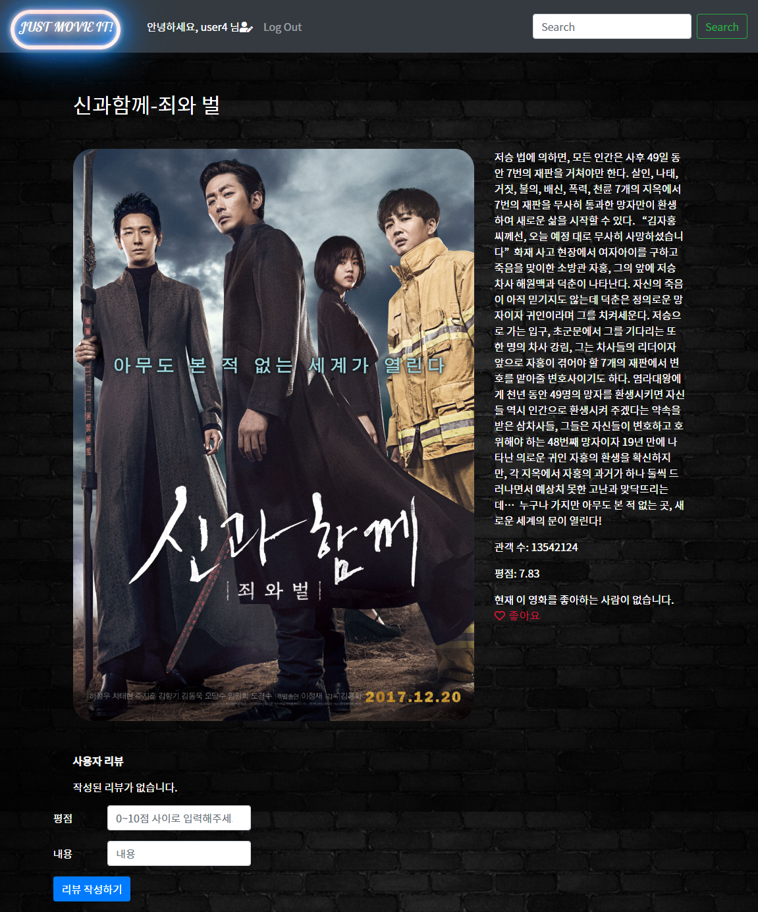


### 리뷰 작성 폼

리뷰 작성 폼은 영화 상세페이지 하단에 나타난다.

이미 리뷰를 작성했다면 기존에 작성한 리뷰 밑에 리뷰 수정 폼을 띄워준다.

본인이 아닌 유저에만 팔로우 버튼이 보이게 구성되어 있다.

리뷰를 달지 않았다면 리뷰 작성 폼이 보인다.

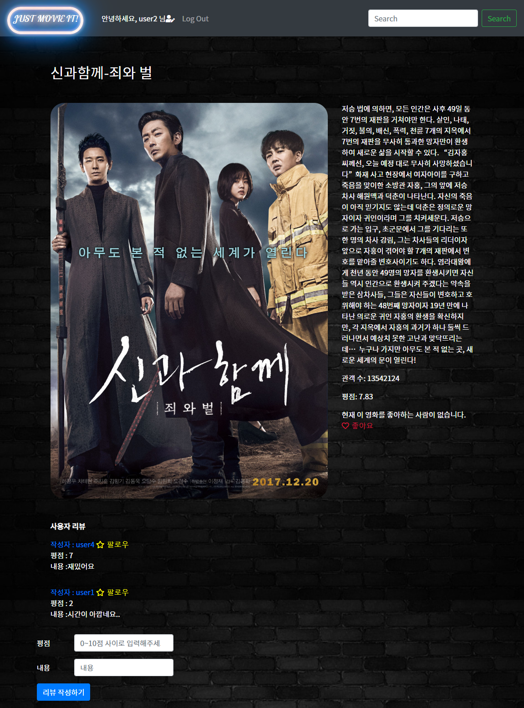


만약 리뷰를 달았다면 리뷰 삭제 버튼이 보이고 리뷰 수정 폼 또한 보인다.

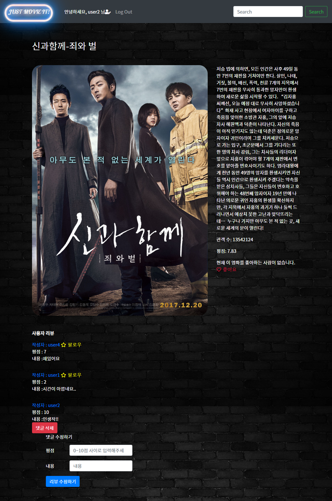

본인의 리뷰에는 팔로우 버튼이 보이지 않으며, 다른 유저가 작성한 리뷰에만 팔로우 버튼이 보인다.

팔로우는 엑시오스를 이용하여 비동기 처리하였다.


### 프로필 페이지

주소:

```html
/accounts/profile/<int:user_id>/
```

user_id는 동적 할당 가능. user_id에 해당하는 유저가 좋아요를 한 영화, 팔로우 중인 유저, 팔로우를 하고 있는 유저를 간단히 확인할 수 있는 페이지를 제공한다.

좋아요를 한 영화 4개까지, 팔로우 중인 유저와 팔로우를 하고 있는 유저를 각 5명까지 보여준다.

더 보러가기를 통해서 모든 내용을 확인할 수도 있다.

자신이 자신의 프로필 페이지에 올 경우 프로필을 수정할 수 있는 수정 폼이 보여진다.

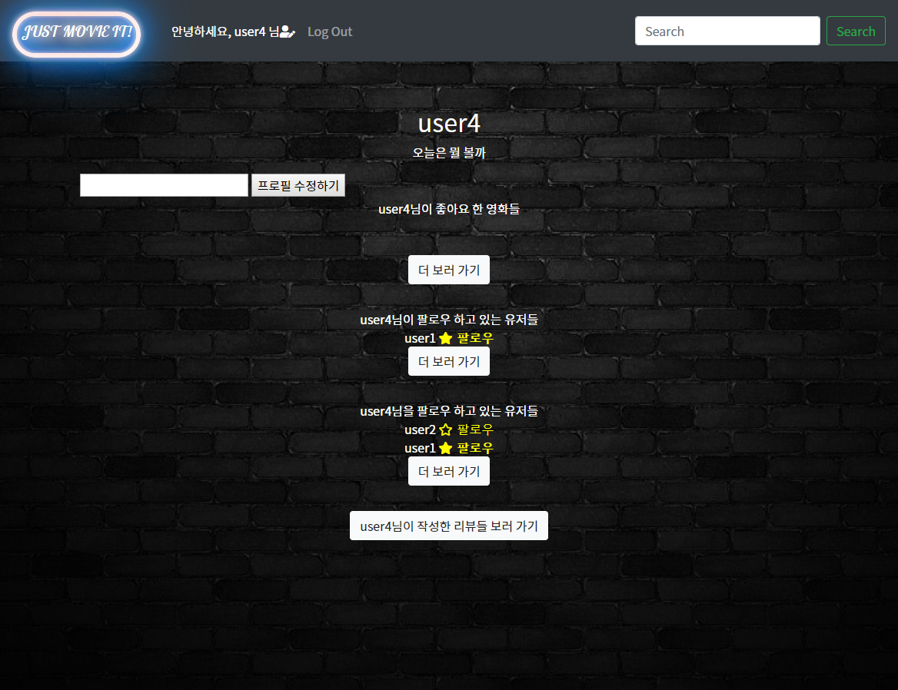


### 네비게이션 바

메인페이지로 가는 JUST MOVIE IT! 로고 및 로그인, 로그아웃, 회원가입 검색기능이 존재한다.

 JUST MOVIE IT! 로고와 검색 폼은 누구에게나 보여진다.

로그인 한 유저의 경우엔 프로필 이동, 로그아웃이, 로그인 하지 않은 유저의 경우엔 로그인, 회원가입이 추가로 보여진다.

관리자 계정으로 접속할 경우 관리자 페이지로 이동할 수 있는 링크가 보여진다.


### 검색 기능

네비게이션 바에 존재하는 검색 바는 검색어를 입력한 후 Search버튼을 누르면 그 검색어에 해당하는 영화를 검색하여 보여준다.

검색어가 감독 명, 영화 명, 영화 설명, 장르에 포함되어 있는 영화를 보여준다.

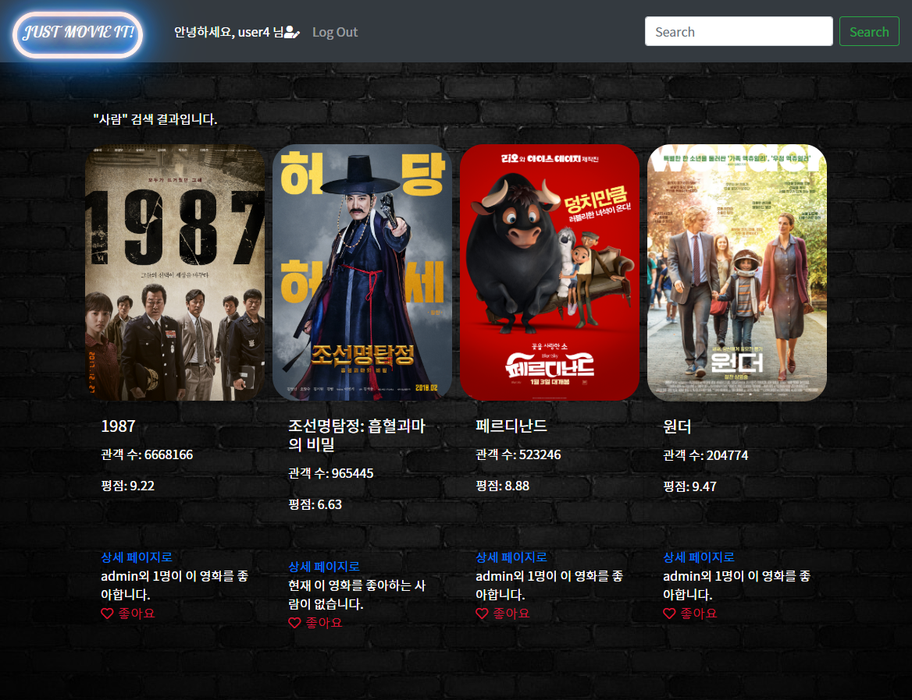


### 관리자용 페이지 공통

모든 관리자용 페이지에 권한이 없는 유저가 없는 경우 401 에러를 반환한다.

유저 관리, 영화 관리, 데이터 입력 받기로 이동하는 버튼이 있다.

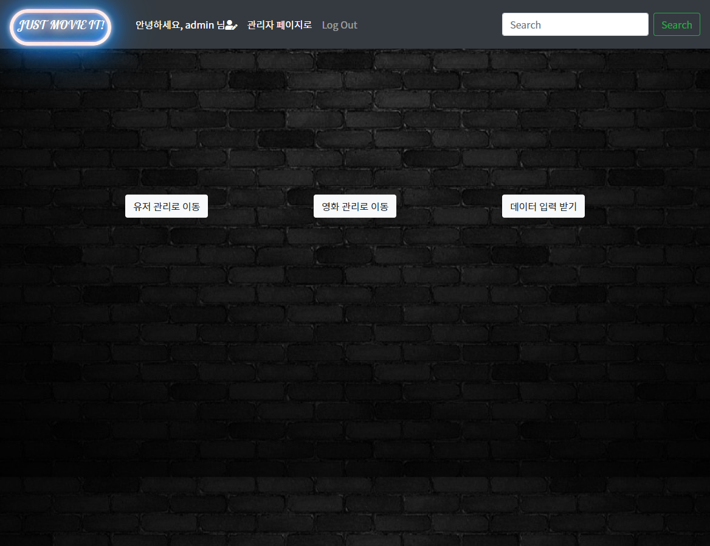


### 관리자용 유저 수정 및 삭제 기능

유저 관리를 누르면 관리자용 유저 목록 페이지로 이동한다.

유저 목록에서 수정하고 싶은 유저를 선택하면

유저 상세 정보 창으로 이동하고 나이를 확인할 수 있다.

회원 수정을 누르면 수정 폼으로 이동하고 회원 정보를 수정할 수 있다.

회원 삭제를 누르면 회원이 탈퇴된다.

관리자용 회원 목록 페이지

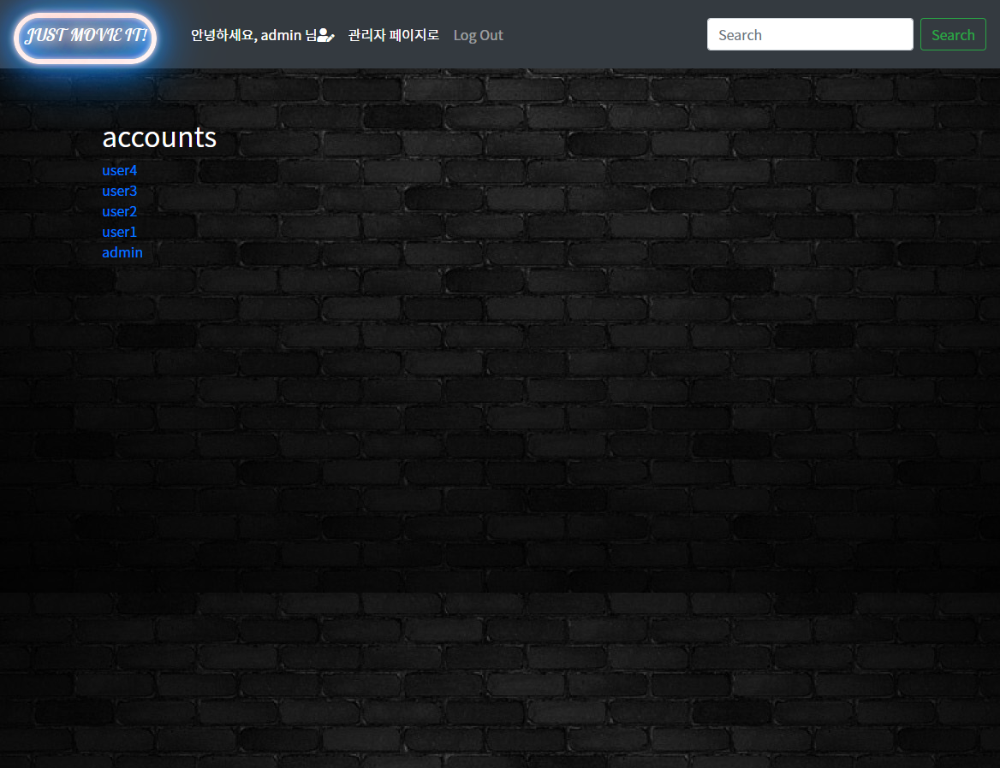


관리자용 회원 상세 페이지

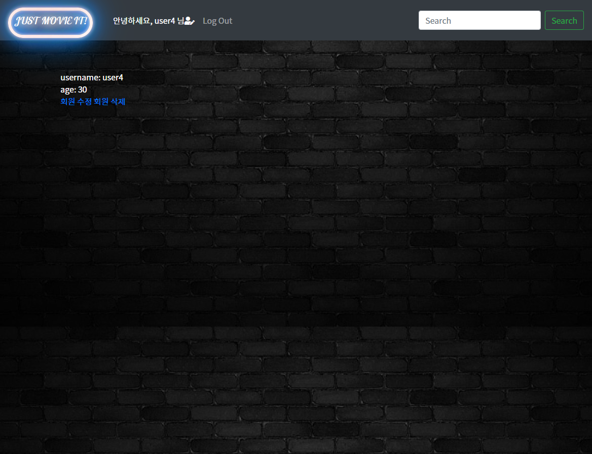


관리자용 회원 수정 페이지

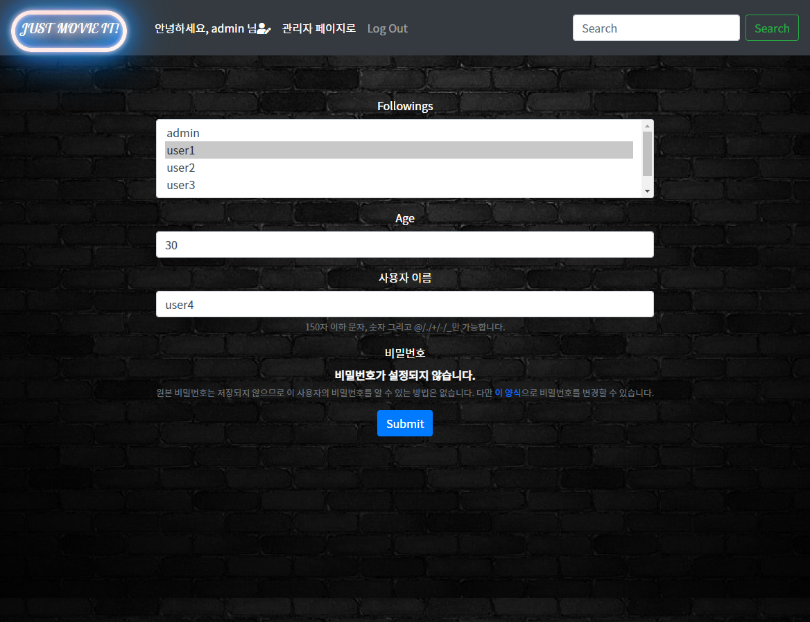


### 관리자용 영화 추가, 수정 및 삭제 기능

영화 관리를 누르면 관리자용 영화 목록 페이지로 이동한다.

상단에 영화 추가하기 버튼을 누르면 영화를 직접 입력할 수 있다.

그 밑으로는 등록된 모든 영화들이 보인다.

해당하는 영화를 누르면 디테일페이지로 이동하고 최 하단에 영화 수정, 영화 삭제, 관리자용 영화 목록으로 이동할 수 있는 링크가 있다.(관리자만 볼 수 있는 메뉴)

관리자용 영화 목록 페이지

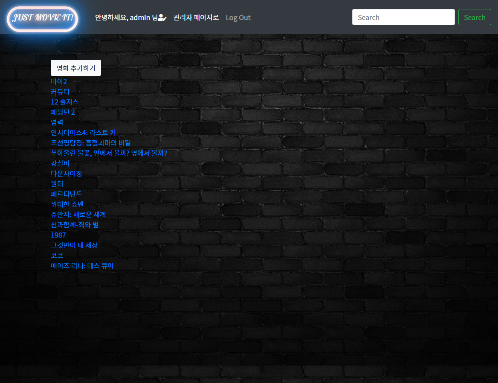


관리자용 영화 수정 페이지

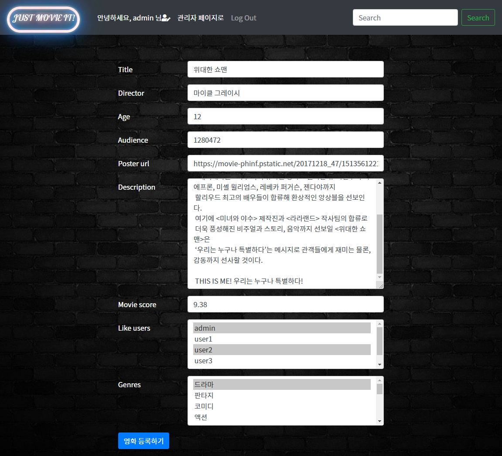


### 데이터 입력 받는 기능

데이터 입력 받기를 누르면 다음과 같은 창이 나타난다.

시작일과 종료일을 입력하면 해당 기간의 박스오피스 데이터를 받아와 데이터베이스에 저장을 해 준다.

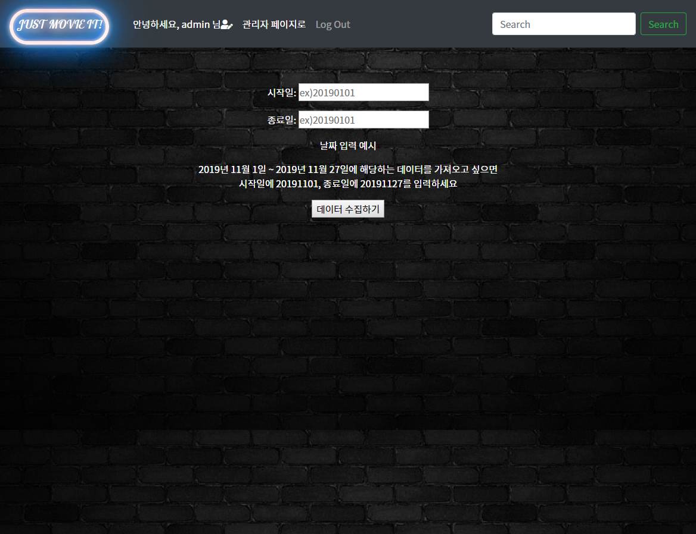


### ERD

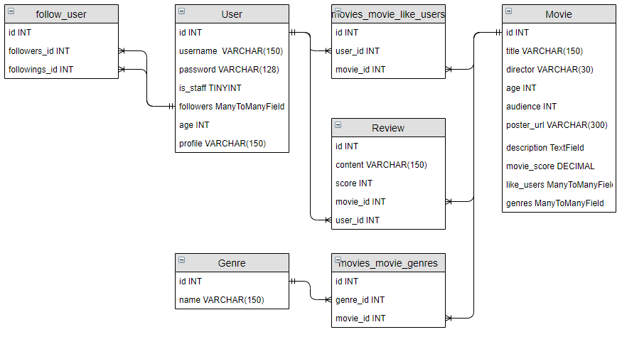


## 후기

김평강:

깃을 이용하여 협업하는 과정에서 브랜치 충돌을 피하기 위해 최대한 역할을 분담하여 진행하였으나 그래도 충돌은 발생하였고 실수로 커밋이 되지 않은 상태에서 PULL하거나 최신버전이 아닌데 조금만 수정해서 커밋하고 올려버려서 덮어씌어지는 등 시행착오를 많이 겪었습니다. 협업하는 과정에서 역할을 분담하지 않고 무분별하게  필요한 작업을 진행했다면 더 많은 문제점이 발생했을 것이라 생각합니다.

이 과제를 진행 하면서 브랜치 관리의 중요성을 느낄 수 있었습니다. 지금은 작은 프로젝트라서 이 브랜치 저 브랜치 옮겨다닐 일이 잦고 여러 충돌들을 해결하기 쉬웠지만 규모가 큰 프로젝트 일수록 브랜치를 옮겨 다니는 시간이 더 길고 충돌을 해결하는 것이 어려워 질 것이라 생각합니다. 변수를 통일화하고 알아보기 쉬운 코드의 작성, 작업을 시작하기에 앞서 사전에 부분적인 목표들을 설정하여 그것을 조합해 하나의 기능을 구현하는 것이 필요하다는 것을 느꼈습니다.


배태한:

git을 활용하는데 있어 미숙한 점이 많아 동료의 도움을 많이 받았습니다.  git을 사용하는데 있어 어려움도 있었지만 그만큼 분업의 효율성이 증가해 작업을 어떻게든 제 시간 안에 마무리 지을 수 있어서 좋았습니다.

처음으로 API를 혼자 힘으로 사용하고, 크롤링을 하기 위해 모듈을 설치해 직접 부딪혀 볼 수 있었던 좋은 경험이었습니다. 5일동안 힘들었지만 데이터를 받아 DB에 성공적으로 저장했을 때는 그만큼 성취감도 컸던 것 같습니다.

제가 맡은 역할에 전념할 수 있게 도와주고 전체적인 서비스의 방향성과 설계를 지도해준 평강님에게 감사의 마음을 전합니다.